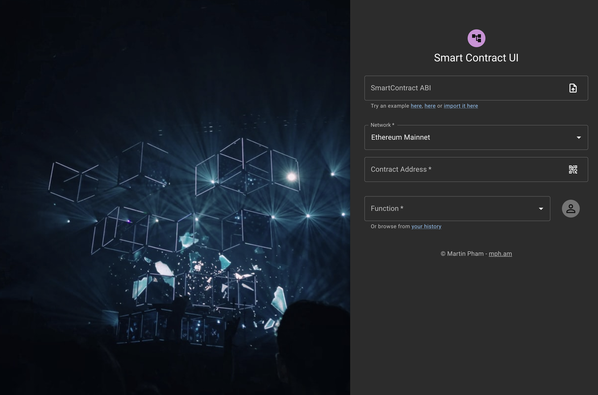
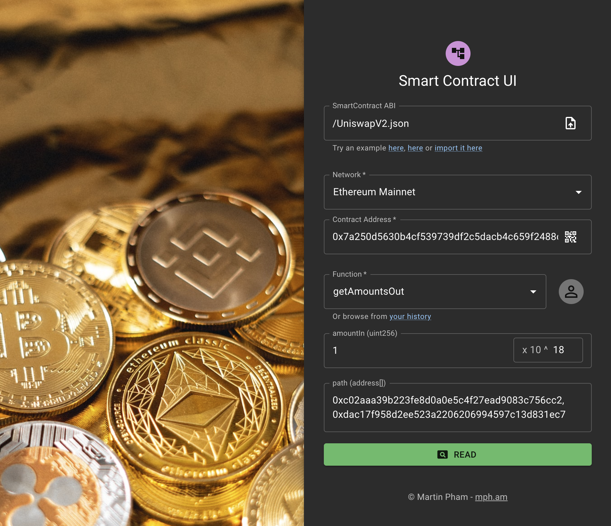
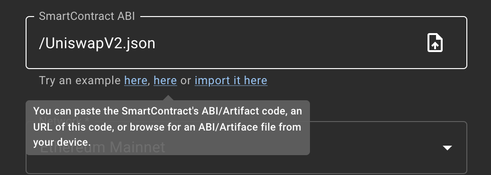
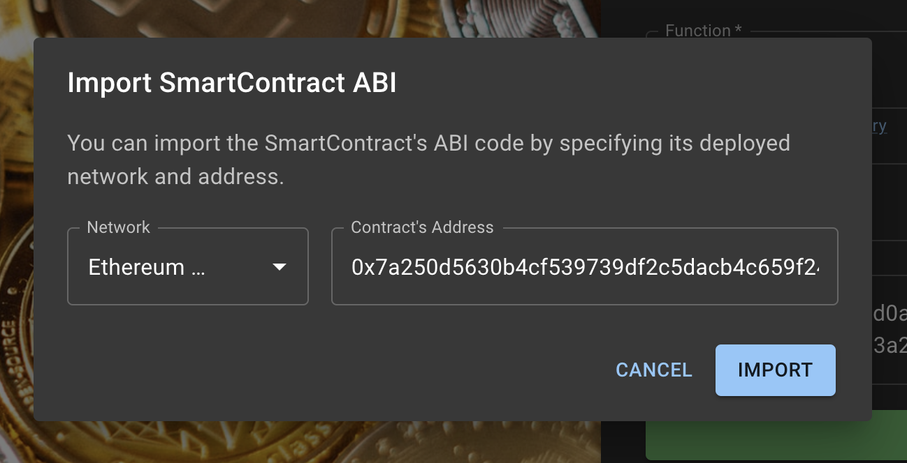
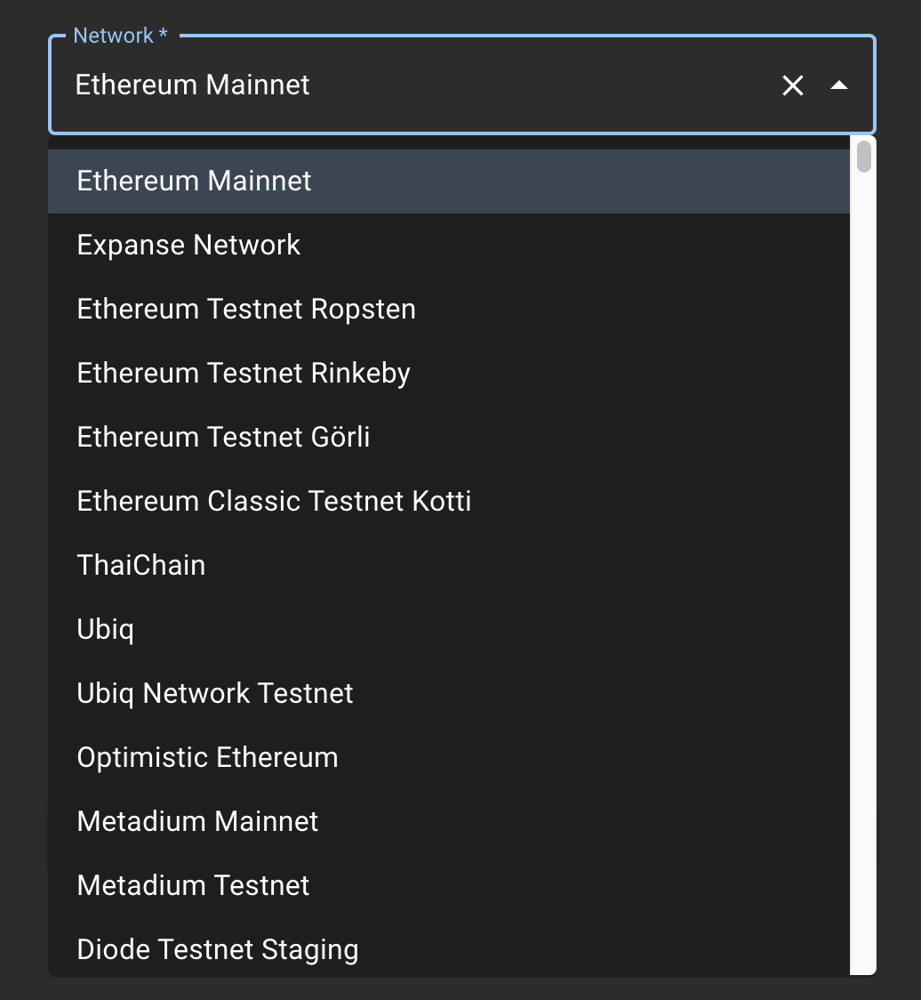
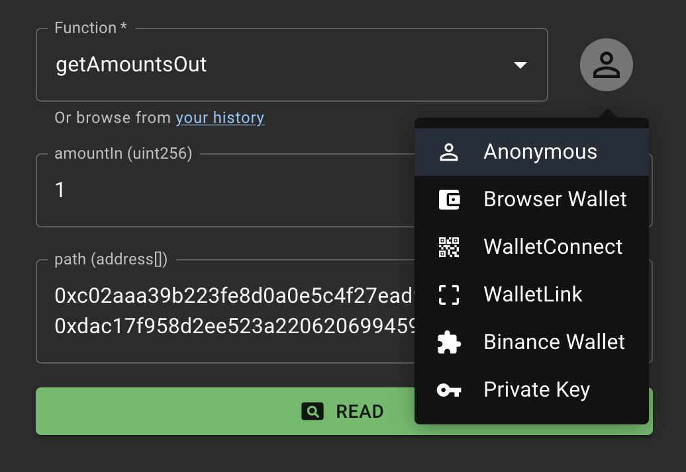

  
   
  

    <h3>
      <b>
        SmartContract UI
      </b>
    </h3>
  

  

    <b>
      Open source Blockchain's Smart Contract Tool
    </b>
  

  

  

   
  

  

  
<b>Table of contents</b>

---

- [Homepage](#homepage)
- [Features](#features)
- [Usage](#usage)
	- [Config ABI](#config-abi)
	- [Import from deployed contract](#import-from-deployed-contract)
	- [Select network](#select-network)
	- [Specify contract's address](#specify-contracts-address)
	- [Setting function & arguments to call](#setting-function--arguments-to-call)
- [Contributing](#contributing)
- [Changelog](#changelog)
- [License](#license)

---

### **Homepage**

[contract.mph.am](https://contract.mph.am/)

### **Features**

- Discover millions deployed Smart Contracts across over 260 blockchains.
- Easy to read and write Smart Contract's data with a friendly UI.
- Sign your request in many ways: with Browser using Metamask Wallet, Binance Wallet, or with TrustWallet's WalletConnect protocol, Coinbase's WalletLink protocol, or importing your wallet from key.
- <b>Offline-First: </b> You can use it anywhere, even without a network connection.

**To suggest anything, please join our [Discussion board](https://github.com/MartinPham/smartcontract-ui/discussions).**

## **Usage**

Straightforward, to interaction with a Smart Contract, you'd need to know:
- What interfaces <b>(ABI)</b> did the contract expose
- The contract was deployed on which blockchain <b>(network)</b>
- Which <b>function</b> and its <b>arguments</b> you'd like to call

<b>Example:</b>
Let's play with the [Uniswap Protocol](https://uniswap.org/): We'd like to understand how much <b>USDT</b> does <b>1 WETH</b> worth currently. 

To do it, we'd have to call the function [<b>getAmountsOut</b>](https://docs.uniswap.org/protocol/V2/reference/smart-contracts/library#getamountsout), on the [<b>Uniswap Router</b>](https://docs.uniswap.org/protocol/V2/reference/smart-contracts/router-02) contract, which was deployed on <b>Ethereum Mainnet</b>. You can try it [here](https://contract.mph.am/?json=/UniswapV2.json&address=0x7a250d5630b4cf539739df2c5dacb4c659f2488d&func=getAmountsOut&args.amountIn=1e18&args.path=0xc02aaa39b223fe8d0a0e5c4f27ead9083c756cc2,%200xdac17f958d2ee523a2206206994597c13d831ec7&network=1).

### **Config ABI**

To config the interface (ABI), you could paste the entire ABI's JSON into the <b>SmartContract ABI</b> text field, or simply put the URL of the ABI's JSON, or you can can also upload the ABI's JSON from your computer. It can also read the Truffle's build artifact JSON file.

### **Import from deployed contract**

If you don't have the contract's ABI, you could also import it from the deployed contract

### **Select network**

Next thing to configure is the blockchain network where the contract was deployed. There are more than <b>260 chains</b> supported.

### **Specify contract's address**

After selecting the network, you could specify the address of the contract. 

<b>Tip:</b> You can also use the camera to scan the contract's address on a QR code.

### **Setting function & arguments to call**

In the final step, you can choose which function you want to call, and specify its arguments.

<b>Tip:</b> You can also choose how to sign the call, by selecting your preferred wallet.

## **Contributing**

Please contribute using [GitHub Flow](https://guides.github.com/introduction/flow). Create a branch, add commits, and then [open a pull request](https://github.com/MartinPham/smartcontract-ui/compare).

## **Changelog**

- <b>0.0.1</b> (2022-01-01): I'm proud to release the first version of <b>SmartContract UI</b>!

## **License**

This project is licensed under the [GNU General Public License v3.0](https://opensource.org/licenses/gpl-3.0.html) - see the [`COPYING`](COPYING) file for details.